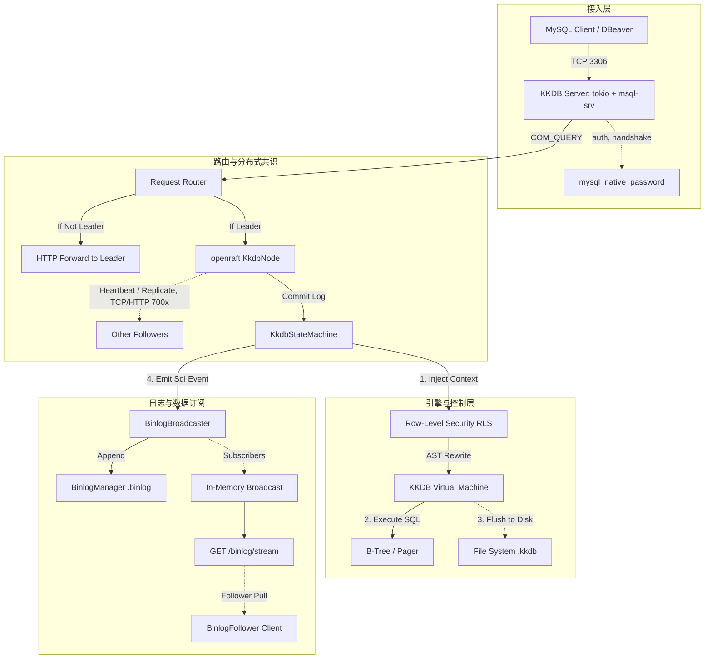

# KKDB (Kivi RDBMS) 架构与部署指南

KKDB 是一款使用 Rust 编写的，兼容 MySQL 协议、自带高可用分布式共识（Raft）、支持增量数据订阅（Binlog）、并且具备企业级行级别安全性（RLS）的新型分布式关系型数据库。

本指南旨在为后续维护者（以及 Agent）提供系统的全局架构全貌，同时为运维和开发人员提供集群环境下的详细部署操作指导。

---

## 1. 核心架构图解 (Architecture Overview)

KKDB 的系统架构由上至下可以分为四大核心层：

1. **协议层 (Protocol Layer / Server)**
2. **集群共识层 (Consensus / Raft Layer)**
3. **安全与控制层 (Security & Control)**
4. **SQL 执行与存储层 (SQL VM & Storage)**



### 1.1 Server层 (MySQL兼容协议)
- **底层实现**：原生集成 `tokio` 异步网络模型栈，处理大量并发连接。
- **协议兼容**：实现了 MySQL V10 Handshake 协议，并支持标准的 `mysql_native_password` 认证。
- **兼容组件**：主流工具（如 Navicat, DBeaver, PDO, Sequelize, JDBC）均可按 MySQL 8.x / 5.7 标准接入。

### 1.2 分布式共识 (Raft)
- **核心组件库**：选用强大的 `openraft` 库构建底层 Node 和 Cluster 抽象。
- **状态机**：`KkdbStateMachine` 包裹了 KKDB 的执行引擎。所有的写入操作（DDL / DML）均先写 Raft 日志，多数派节点确认后，统一回调 `apply()` 写入本地 B-Tree 存储。
- **强一致性读写**：
  - **Multi-Writer**: 客户端可连接任意节点。Follower 节点遇写入请求，将透明转发至 Leader 执行。
  - **Multi-Reader**: 读操作默认使用 `ReadIndex`（Linearizable Read）保障数据强一致获取。

### 1.3 行级安全性 (RLS) 与权限系统
- **认证打通**：MySQL 连接建立时即绑定用户至当前环境上下文。
- **策略拦截**：类似 Postgres / Supabase 的设计。基于 `kkdb_users`, `kkdb_policies` 系统表对用户的 `SELECT`, `UPDATE` 等操作在 AST 层强制改写，将 `CREATE POLICY ... USING (expr)` 动态拼接到 `WHERE` 子句。
- **上下文感知函数**：全面支持 `current_user()`, `current_setting('request.jwt.sub')`, `auth.uid()`，实现零代码业务层滤过隔离。

### 1.4 日志与流式订阅 (Binlog)
- **流式推送引擎**：内置的 `BinlogBroadcaster` 利用 Tokio 并发管道在内存中实时进行 fan-out 广播。
- **增量拉取复制**：针对跨广域网或只读节点拓扑（异地容灾），提供 HTTP 端点 `GET /binlog/stream?from_pos=X`，返回 `NDJSON` 文本数据流。
- **记录级别细节**：由于使用了 Statement-Based 复制模型，每次 Raft StateMachine Commit，它会将带环境上下文和 `user_id` 的原 SQL 追加进入底层 `BinlogManager`。

---

## 2. 部署与集群搭建指南 (Deployment Guide)

KKDB 的默认网络端口约定如下：
- **MySQL 服务端口**: `3306` (TCP) - 面向业务与客户端连接。
- **Raft 内部 RPC / 可观测性端口**: `7001, 7002...` (HTTP) - 内部节点通信、增量 Binlog 流与 Snapshot 同步。

### 2.1 准备系统环境

**系统软硬件要求:**
- CPU/Memory: Linux (Ubuntu 22.04+ 或 RHEL 8+) / macOS / Windows Server
- 运行依赖: 无额外依赖只需系统装有 `curl` / `wget` 供测试。
- 环境变量: (需设定以开启 RLS JWT 功能)
  ```bash
  export KKDB_JWT_SECRET="your-256-bit-extremely-secure-random-secret"
  ```

**构建项目二进制:**
进入项目根目录 (如果源码级别部署)：
```bash
cargo build --release
cp target/release/kkdb /usr/local/bin/
```

### 2.2 启动单节点开发模式 (Standalone / Bootstrap)

开发测试环境下，如果你只需一个简单的数据库无需高可用容灾：

```bash
# - 节点ID定义为 1
# - 数据挂载在 /tmp/kkdb_data_1
# - 不填 --peers 参数，自动将己方声明为主节点 (Leader) 并 Bootstrap 集群
kkdb --id 1 \
     --api-addr 127.0.0.1:7001 \
     --data-dir /tmp/kkdb_data_1 \
     --port 3306
```

此时，可直接使用 MySQL Cli 工具测试：
```bash
mysql -h 127.0.0.1 -P 3306 -u root -p
```

### 2.3 部署生产级 3 节点高可用架构 (High Availability)

假设我们在本地机器起三个进程模拟，分别使用 7001、7002、7003 通信，各自响应 MySQL 3306, 3307, 3308 端口。

#### Step 1: 启动全部节点并声明集群网络拓扑

> ⚠️ 注意：首次启动多节点集群时，所有节点均启动为 **"Learner (无投票权副本)"**，它们自己不知道谁是主节点。

**启动 Node 1:**
```bash
kkdb --id 1 \
     --api-addr 127.0.0.1:7001 \
     --data-dir /tmp/kkdb_n1 \
     --peers "2=http://127.0.0.1:7002,3=http://127.0.0.1:7003" \
     --port 3306
```

**启动 Node 2:**
```bash
kkdb --id 2 \
     --api-addr 127.0.0.1:7002 \
     --data-dir /tmp/kkdb_n2 \
     --peers "1=http://127.0.0.1:7001,3=http://127.0.0.1:7003" \
     --port 3307
```

**启动 Node 3:**
```bash
kkdb --id 3 \
     --api-addr 127.0.0.1:7003 \
     --data-dir /tmp/kkdb_n3 \
     --peers "1=http://127.0.0.1:7001,2=http://127.0.0.1:7002" \
     --port 3308
```

#### Step 2: 初始化并组建 Raft Cluster

向任意一个拥有完整视角的节点（例如 node 1 的 `7001` 端口）发起一个 POST 动作，要求利用当前拓扑强行组成一个集群选举决出 Leader：

```bash
curl -X POST http://127.0.0.1:7001/raft/init
```
如果返回 `{"status":"ok"}`，代表集群选举完成。KKDB 现在具备了允许“任何一个节点宕机而不影响读写”的灾备能力了！

#### Step 3: 扩缩容运维 (Add Observer/Learner)

如果你希望加入第 4 个节点只作为提速读库（只读副本）或灾备，而不参与选主计票：

**1. 启动 Node 4 (Learner):**
```bash
kkdb --id 4 \
     --api-addr 127.0.0.1:7004 \
     --data-dir /tmp/kkdb_n4 \
     --peers "1=http://127.0.0.1:7001" \
     --port 3309
```
**2. 通知集群将其纳入复制视野:**
```bash
curl -X POST http://127.0.0.1:7001/raft/add-learner \
     -H "Content-Type: application/json" \
     -d '{"node_id":4, "api_addr":"http://127.0.0.1:7004"}'
```

### 2.4 设置跨云 Binlog 级联监听 (Optional Follower Tooling)

由于网络极其不稳定无法运行长连接 Raft 时，KKDB 提供了一个轻量级的 `Binlog HTTP 流`，完全可以使用一个无状态工具监听主集群动态。

- **流地址**: `http://<Leader IP>:7001/binlog/stream?from_pos=0`
- **拉取方式**: 持续性的 HTTP Chunk 流，返回 JSON 变更高水位和 Data payload 记录。可以使用内置在源码库中的 `BinlogFollower` (见 `src/binlog/mod.rs:BinlogFollower::run_loop()`) 作为实现蓝本编写你自己的 CDC 数据下游转存消费程序 (供类似 Flink 或 Elasticsearch 加工使用)。

---

## 3. 运维与排错 (Troubleshooting)

1. **MySQL 无法连接，错误提示 Invalid Password？**
   * *排查*：检查是否遗留了老版本数据库目录。你可以连接上以后通过 `CREATE USER 'xxx' IDENTIFIED BY 'xxx'` 初始化凭据，而不是手工改文件。如果是用旧密码迁移过来的，留意我们在底层已经自动升级（Lazy Migration）成了安全 Hash，不要覆盖相关日志。
2. **集群不响应写操作并提示 'Quorum Not Achieved' 或 'Cannot propose to follower'？**
   * *排查*：当前存活节点数低于集群 `(N/2)+1` 多数派时会引发“脑裂”保护，停止写入服务。检查进程存活状态；同时确保 Node 的 `--peers` 表正确传达。如果确定有一大半机器报废找不回来，只能清空新机器数据基于冷备重建 Raft 初始化，或者移除坏死的成员：(使用类似 `/raft/change-membership` 运维 API 隔离故障节点)。
3. **遇到 Data Corrupt 现象怎么办？**
   * *排查*：这往往发生在宿主文件系统损坏时，KKDB 启用了内置的 CRC32。重启进程尝试依靠 WAL 恢复；若无解，清空 `data-dir/raft/` 与 `.kkdb` 文件，通过将故障节点直接挂入健康集群作为 Learner 来强制 `InstallSnapshot` 全量自动灌盘恢复。
